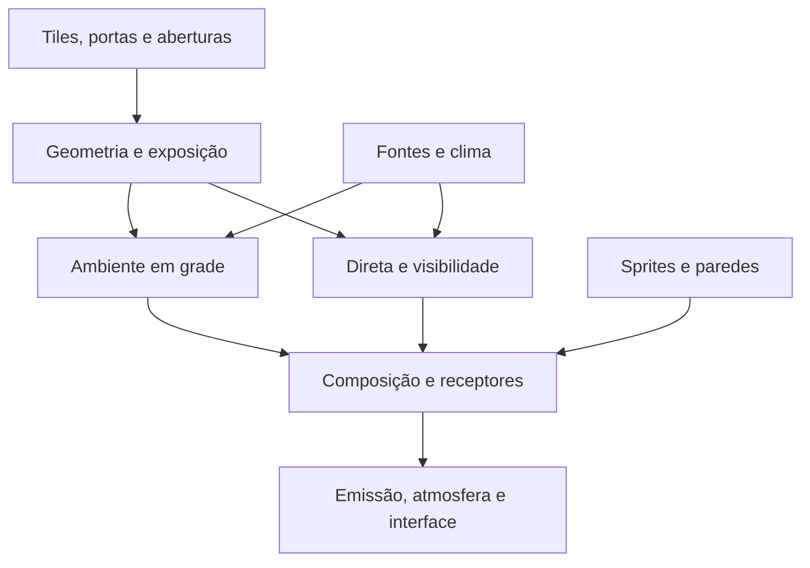

# Nyvorn V8 — pesquisa de iluminação dinâmica 2D e auditoria

Data da pesquisa: 12 de setembro de 2026. Destino: uma implementação nova em C# e MonoGame DesktopGL. Este documento é uma pesquisa e especificação técnica proposta; não é um relato de implementação ou de testes executados no jogo.

**Recomendação:** construir um sistema híbrido pequeno: ambiente em uma grade econômica, visibilidade geométrica para a luz direta, tratamento explícito das superfícies do terreno e uma composição por pixel. Não exigir normal maps, simulação de radiosidade, SDF, ray tracing de iluminação global ou Radiance Cascades para atingir o conjunto principal de efeitos das referências.

Uma V8 limpa pode reaproveitar os contratos de mundo, câmera, fontes, clima e captura. O que deve ser novo é o cálculo/composição da iluminação. Reescrever mineração, geração, câmera ou entidades aumentaria o escopo sem resolver a luz.

## 1. O que foi efetivamente auditado

Foram consultados o repositório indicado pelo usuário, o documento anexado `LIGHTING_V7.md`, o relato colado na conversa e as quatro referências visuais disponíveis na conversa. Foram obtidos 17 arquivos de código/projeto para inspeção dirigida. Não foi obtido o working tree do computador do usuário. Não executei build, jogo, benchmark ou captura de runtime do Nyvorn nesta pesquisa.

| Evidência | Estado e alcance |
|---|---|
| Branch pública `main` | Commit `28df7ae786ab237183f1c24d2f22e4d4ba4290c0`, datado de 11/08/2026; baseline V6. |
| Branch pública `content` | Apontava para o mesmo commit na consulta. |
| Branch pública `physics` | Apontava para outro commit; não foi a base desta auditoria de iluminação. |
| Documento V7 anexado | Registra fases 2 e 3 entregues em 11/09/2026 e contém, abaixo, o histórico de fases anteriores. |
| Auditoria colada na mensagem | Descreve um estágio anterior ao estado final relatado no documento V7. |
| Screenshots e tempos citados na V7 | Relatos do documento. Não foram reproduzidos nem medidos por mim. |

O repositório público e o documento não representam o mesmo estado. O fato de um método existir na V6 pública não prova que ele ainda esteja ativo na V7 local. A ausência de `LightingV7/` na árvore pública também não desmente sua existência local. [Commit público auditado](https://github.com/IsraelOliver/Nyvorn/commit/28df7ae786ab237183f1c24d2f22e4d4ba4290c0).

Os anexos de lore e `Source-Inventory-Detailed.pdf` que falharam no envio não foram usados. Eles não são necessários para esta recomendação. Para uma auditoria executável da V7, o material decisivo seria o código atualizado, incluindo shaders e o estado de integração em `PlayingState`.

## 2. Contrato visual das referências

O objetivo não é reproduzir a textura das referências. As paredes de background já são superfícies desenhadas: devem receber iluminação e mostrar as sombras dos bloqueadores de foreground. Uma rachadura pintada no tile não é um obstáculo geométrico.

| Elemento | Função na iluminação proposta |
|---|---|
| Céu, nuvens, montanhas distantes | Paisagem distante com cor por horário/clima; não recebe a luz de uma tocha próxima. |
| Parede de background | Superfície receptora. Revela luz fria, luz quente e sombras projetadas. Não bloqueia a propagação lateral dentro do espaço jogável. |
| Foreground sólido | Bloqueia luz direta; suas faces expostas recebem luz; o interior do corte do terreno escurece rapidamente. |
| Plataforma | Bloqueador fino, com geometria própria; não deve virar automaticamente um quadrado opaco inteiro. |
| Entidade | Recebe o campo de iluminação por pixel. Projetar uma sombra própria é uma capacidade separada. |
| Chama ou parte emissiva | Continua visível sem iluminação incidente; pode também cadastrar uma fonte que ilumina outras superfícies. |
| Halo e feixe visível | Efeitos de apresentação, com alcance e máscaras próprios. |

Os comportamentos que precisam ser reproduzidos são:

1. Uma abertura clara mantém sua forma e colore suavemente as paredes próximas.
2. A luz artificial perde intensidade com distância, mas é interrompida por obstáculos.
3. Uma plataforma produz um recorte direcional sobre a parede atrás dela.
4. Dentro da sombra de uma fonte, continuam visíveis as contribuições das outras fontes e do ambiente disponível.
5. As bordas do terreno podem estar iluminadas enquanto sua massa interna permanece escura.
6. Dia, pôr do sol, noite e chuva alteram o balanço da cena, sem escurecer os mesmos sprites duas vezes.
7. Luz e sombra continuam presas ao mundo quando a câmera se move ou atravessa a emenda horizontal.

As capturas não demonstram qual algoritmo os jogos de referência utilizam. As escolhas abaixo são uma proposta para Nyvorn, não uma identificação do renderer de Kyora ou de outro jogo.

## 3. Correções conceituais que evitam outra reescrita

### 3.1 Luz direta não significa necessariamente sombra dura

Uma fonte pontual ideal produz transições geométricas duras. Uma fonte com extensão pode produzir penumbra, porque um ponto da superfície enxerga parte da fonte e perde outra parte. Portanto, a frase “luz direta produz sombra dura por definição” é excessiva. Para a primeira versão funcional da V8, a aproximação pontual é uma escolha simples e apropriada; a suavidade pode ser adicionada depois. [PBRT: luzes pontuais](https://pbr-book.org/4ed/Light_Sources/Point_Lights), [PBRT: luzes de área](https://pbr-book.org/4ed/Light_Sources/Area_Lights).

### 3.2 Atenuação e visibilidade são variáveis diferentes

Para uma fonte local, a expressão de trabalho é:

`Direct_i(p) = Color_i × Intensity_i × Falloff(distance) × Visibility_i(p)`

`Visibility` vale 0 ou 1 no modelo pontual opaco. O falloff continua suave. A existência do degradê não enfraquece a correção da sombra. O erro aparece quando um obstáculo opaco reduz apenas um pouco a intensidade, em vez de eliminar a contribuição direta daquela fonte.

Uma travessia por raio não precisa gerar glow. DDA pode responder uma pergunta binária perfeitamente útil: “há um bloqueador antes do receptor?”. O problema está na regra de interseção, na geometria ou na resolução escolhida, não no fato de usar um raio. O trabalho de Amanatides e Woo é a referência histórica para percorrer células de uma grade; a abertura do PDF do autor falhou nesta sessão, por isso não trato seu texto integral como lido. [Registro do artigo original na Eurographics](https://diglib.eg.org/items/60c72224-00f3-416d-9952-ee41e8c408da).

### 3.3 Flood fill é uma aproximação artística, não luz rebatida física

Uma propagação local é útil para preencher espaços e contornar quinas. Ela não calcula, por si só, a distribuição de energia refletida por superfícies, orientação de materiais ou conservação de energia. Pode aproximar o ambiente desejado sem resolver esses fenômenos. Separar canais de céu e fontes locais permite mudar a cor do dia sem recalcular toda a geometria. [Mikola Lysenko: Voxel lighting](https://0fps.net/2018/02/21/voxel-lighting/).

Consequência prática: chamar o parâmetro de `BounceStrength` não torna o resultado um bounce físico. Um valor alto pode preencher tanto a sombra que ela deixa de ser percebida, mesmo com visibilidade direta correta.

### 3.4 Sombra não é uma camada preta global

Cada fonte deve ter sua própria visibilidade. A sombra da tocha A elimina a contribuição direta de A, mas não deve apagar B, o céu ou os emissivos. Desenhar um polígono preto sobre a imagem final costuma violar esse contrato.

A visibilidade pode ser calculada como a região iluminada, ou como a região bloqueada a subtrair de uma luz específica. Ambas as construções são válidas. [Amit Patel: 2D Visibility](https://www.redblobgames.com/articles/visibility/).

### 3.5 Sombras projetadas não exigem normal maps

O normal map muda como uma superfície reage à direção incidente. O oclusor determina onde a fonte é bloqueada. São informações distintas. A própria documentação de iluminação 2D do Godot separa luzes, receptores, oclusores e mapas de normais/especulares. Para Nyvorn, as paredes existentes podem receber os recortes sem receber mapas de normais novos. [Godot: luzes e sombras 2D](https://docs.godotengine.org/en/stable/tutorials/2d/2d_lights_and_shadows.html).

## 4. Auditoria do código público: achados confirmados

### 4.1 Cálculo e integração

No commit público, `PlayingState.Draw` chama a V6, atualiza sua textura e segue para `DrawGameplayWorld`. Nesse caminho, a máscara de produção é multiplicada sobre o terreno; entidades são desenhadas depois com um sampler de luz. Não é o pipeline Pixel/V7 relatado no documento de setembro. [PlayingState auditado](https://github.com/IsraelOliver/Nyvorn/blob/28df7ae786ab237183f1c24d2f22e4d4ba4290c0/Nyvorn/Source/Game/States/PlayingState.cs).

| Achado confirmado | Consequência | Encaminhamento para V8 |
|---|---|---|
| Raio padrão da tocha = 9 tiles; perda no ar = 0,08 por tile. | Alcance e formato fortemente limitados pelos parâmetros antigos. | Definir raio e curva separados, calibrados com cena de referência. |
| Background tem distância máxima 10 e falloff 0,10. | Ambiente se extingue rapidamente por regra, não por geometria do cenário. | Usar um alcance de ambiente explícito, com teste de abertura e corredor. |
| A textura de produção usa `Color[]` e clamp por canal. | Faixa útil limitada a 0..1 nesse caminho. | Acumular em float; decidir a representação de apresentação sem clamp prematuro. |
| `SkyOpen` é convertido diretamente em branco na textura de produção. | O resultado final nessa célula ignora os valores RGB calculados. | Não substituir a exposição pelo branco no passe de apresentação. |
| Classificação usa foreground, depois background, senão `SkyOpen`. | Ausência de parede torna-se significado de céu sem uma política de camada nesse método. | Separar material, exposição exterior e elegibilidade por camada. |
| Luz artificial aplica atenuação ponderada por células atravessadas. | Um obstáculo pode deixar passar energia direta; não há um teste binário de opacidade nesse método. | Substituir a regra por visibilidade para materiais opacos. |

Os parâmetros estão em [V6LightingConfig](https://github.com/IsraelOliver/Nyvorn/blob/28df7ae786ab237183f1c24d2f22e4d4ba4290c0/Nyvorn/Source/Engine/Graphics/LightingPipeline/V6LightingConfig.cs); a conversão para textura está em [V6LightMapRenderer](https://github.com/IsraelOliver/Nyvorn/blob/28df7ae786ab237183f1c24d2f22e4d4ba4290c0/Nyvorn/Source/Engine/Graphics/LightingPipeline/V6LightMapRenderer.cs); classificação, propagação e atenuação estão em [V6LightingSystem](https://github.com/IsraelOliver/Nyvorn/blob/28df7ae786ab237183f1c24d2f22e4d4ba4290c0/Nyvorn/Source/Engine/Graphics/LightingPipeline/V6LightingSystem.cs).

O raio 9 e o falloff linear não são erros universais. São escolhas que não devem ser herdadas como requisitos da V8. O problema estrutural confirmado é representar bloqueio opaco como desconto de energia.

Há um detalhe adicional no método público `ComputeObstacleAttenuation`: o peso do obstáculo é multiplicado por `directionCorrection = 1 / max(|dx|, |dy|)`, em coordenadas de tiles. Esse fator depende da separação entre fonte e destino. Assim, o desconto produzido por uma mesma célula bloqueadora pode diminuir conforme o receptor se afasta. Isso não representa a opacidade fixa de uma parede. A correção é usar uma interseção binária para o material opaco; recalibrar o valor 0,70 não elimina essa dependência indevida. Essa constatação se aplica à V6 pública, não à DDA binária relatada para a V7.

### 4.2 Câmera, wrap e região ativa

`Camera2D` usa zoom padrão 2, calcula a área vista dividindo a janela pelo zoom e arredonda a posição usada na matriz quando `PixelPerfect` está ativo. Já o `Update` da V6 pública calcula a janela de tiles a partir dos pixels de tela sem receber o zoom. Isso pode calcular uma área maior e desalinhada em relação à região visível esperada. [Camera2D](https://github.com/IsraelOliver/Nyvorn/blob/28df7ae786ab237183f1c24d2f22e4d4ba4290c0/Nyvorn/Source/Engine/Graphics/Camera2D.cs), [V6LightingSystem](https://github.com/IsraelOliver/Nyvorn/blob/28df7ae786ab237183f1c24d2f22e4d4ba4290c0/Nyvorn/Source/Engine/Graphics/LightingPipeline/V6LightingSystem.cs).

O draw também condiciona a aplicação da máscara ao loop que contém a origem do buffer. Essa condição é incompatível com a necessidade de cobrir continuamente uma região que cruza a costura; a V7 relata uma correção posterior. Na V8, cálculos de iluminação devem usar coordenadas contínuas próximas da câmera e aplicar wrap somente nas consultas ao mundo.

Usar `floor` para converter posições negativas em tiles. Truncamento de inteiro para zero produz outro resultado próximo da emenda. Usar a mesma câmera efetiva, incluindo arredondamento e zoom, para sprites, luz, máscaras e recortes.

### 4.3 Geometria e geração

`WorldMap.IsSolid` inclui `Platform`. A V8 não deve herdar esse predicado de colisão como definição completa de opacidade. Portas possuem uma consulta própria de bloqueio no caminho V6, que também precisa ser integrada ao novo snapshot de geometria. [WorldMap](https://github.com/IsraelOliver/Nyvorn/blob/28df7ae786ab237183f1c24d2f22e4d4ba4290c0/Nyvorn/Source/Gameplay/World/WorldMap.cs), [PlayingState](https://github.com/IsraelOliver/Nyvorn/blob/28df7ae786ab237183f1c24d2f22e4d4ba4290c0/Nyvorn/Source/Game/States/PlayingState.cs).

`HasOpenSkyAbove` contém a condição `y >= 960`, e também é usado para abrigo/clima. Não é uma consulta limpa de exposição luminosa compatível com as camadas reais. Alterá-lo globalmente poderia mudar chuva ou áudio. Criar a consulta da V8 com os limites de `WorldLayerDefinition`, cujo `EndY` é inclusivo.

A geração preenche Shallow com background de Dirt e Cavern/DeepCavern com Stone. `CarveBackgroundFissures` remove Dirt background na Shallow por ruído, sem testar conexão vertical com o céu. Isso confirma a existência da ambiguidade visual das fissuras; não prova, sozinho, que iluminá-las seja um bug. [BaseTerrainFillPass](https://github.com/IsraelOliver/Nyvorn/blob/28df7ae786ab237183f1c24d2f22e4d4ba4290c0/Nyvorn/Source/Gameplay/World/Generation/Passes/BaseTerrainFillPass.cs), [CavePass](https://github.com/IsraelOliver/Nyvorn/blob/28df7ae786ab237183f1c24d2f22e4d4ba4290c0/Nyvorn/Source/Gameplay/World/Generation/Passes/CavePass.cs).

### 4.4 Fontes e infraestrutura

`TorchInstance.LightOrigin` usa o centro X do poste e uma posição próxima de seu topo. É um ponto de integração já disponível: a V8 deve consumir a posição real da chama, sem quantizá-la ao centro do tile para calcular sombras. [TorchInstance](https://github.com/IsraelOliver/Nyvorn/blob/28df7ae786ab237183f1c24d2f22e4d4ba4290c0/Nyvorn/Source/Gameplay/Crafting/TorchInstance.cs).

O ambiente publicado já fornece estado de céu, clima e eventos; não há motivo para duplicar o relógio do mundo. Pode ser necessária uma curva própria de intensidade da iluminação, porque cor do céu desenhado e irradiância sobre objetos são parâmetros diferentes. [WorldEnvironmentSystem](https://github.com/IsraelOliver/Nyvorn/blob/28df7ae786ab237183f1c24d2f22e4d4ba4290c0/Nyvorn/Source/Gameplay/World/Simulation/WorldEnvironmentSystem.cs).

O projeto público usa .NET 8, `MonoGame.Framework.DesktopGL` e `MonoGame.Content.Builder.Task` com versão `3.8.*`, além de `TieredCompilation=false`. O documento local menciona restauração do mgcb 3.8.4.1. A implementação deve registrar as versões efetivamente resolvidas no checkout local, sem atualizar dependências só para iniciar a V8. [Nyvorn.csproj](https://github.com/IsraelOliver/Nyvorn/blob/28df7ae786ab237183f1c24d2f22e4d4ba4290c0/Nyvorn/Nyvorn.csproj).

## 5. Auditoria da V7 descrita no anexo

Esta seção avalia o projeto relatado, não uma execução observada. O topo do documento é mais recente que as seções de Fase 0 e Fase 1.

### 5.1 O que já avançou e não deve ser apresentado como pendente

O documento relata composição por pixel, entidades sem tint por amostra, chama após a composição, desativação dos tints antigos na V7, raios DDA para direta, sombra de plataforma, fontes de tissue/cogumelos, curva de céu e sol direcional. Relata ainda que o POC de stencil foi movido para uma branch local.

Logo, “falta acrescentar sombras à V7” é um diagnóstico insuficiente. A pergunta correta é: **por que as sombras, a iluminação de aberturas e a apresentação relatadas ainda não entregam o visual desejado?**

### 5.2 Resolução da direta: um limite estrutural

O documento descreve visibilidade do centro da fonte ao centro de cada célula. O mapa resultante tem uma amostra por tile e é ampliado para a composição. Mesmo que essa amostra seja binária, a sombra entre os centros não foi calculada.

Com tiles de 8 pixels de mundo e zoom 2, uma amostra representa 16 pixels de tela por dimensão. A interpolação bilinear pode suavizar a transição entre células, mas não inventa corretamente a sombra de uma plataforma fina, a posição subpixel da chama ou o recorte exato de uma quina.

**Encaminhamento:** manter baixa resolução para ambiente; calcular/rasterizar direta em resolução de pixel da arte ou equivalente. Não tentar resolver esse limite aumentando contraste, AO ou quantidade de varreduras.

### 5.3 `max(Bloco, Céu)` é uma escolha artística com consequências

O documento troca a soma por máximo por canal. Isso evita alguns estouros, mas faz a contribuição menor desaparecer naquele canal. Uma tocha pode acrescentar pouco ou nada em uma região diurna, até superar o céu.

O máximo é útil para escolher o melhor caminho de uma aproximação de propagação e para unir máscaras de uma mesma fonte. Como composição final de fontes independentes, ele muda deliberadamente o modelo. A recomendação da V8 é soma controlada, com intensidades coerentes e tratamento dos realces na saída.

Não se deve somar “céu diurno já completo” e “sol completo” como se ambos fossem uma unidade de exposição independente. Separar um preenchimento difuso e uma contribuição solar evita tentar consertar exposição excessiva com `max` depois.

### 5.4 AO aplicado a tudo escurece o termo errado

A fórmula descrita multiplica o resultado combinado por AO. Assim, a contagem de vizinhos sólidos pode reduzir até uma parede diretamente iluminada por uma tocha. Isso pode deixar bordas sujas e roubar contraste de superfícies que deveriam se destacar.

Na proposta V8, eventual AO afeta apenas o ambiente/indireta. A luz direta responde à sua própria visibilidade. Começar com AO desligado; a geometria e o ambiente já podem gerar escuridão suficiente nos cantos.

### 5.5 O limite da Shallow precisa acontecer dentro da Shallow

O documento menciona um `SkyCap` que começa a cair após `shallowEnd`, durante 12 linhas. Essa descrição permite ambiente de céu nas primeiras linhas da Cavern, apesar de outra seção afirmar zero nessa camada.

Sem o código V7, não é possível resolver essa divergência. Para a V8, o contrato é explícito: a transição, se existir, termina no fim da Shallow. Na primeira linha da Cavern o ambiente de céu vale exatamente zero. Aplicar o corte também após interpolação, para texels claros da borda não contaminarem a camada inferior.

### 5.6 O sol relatado não demonstra o caso visual principal

A V7 relata uma recorrência inclinada e uma consulta de entrada pelo topo da região. Também declara que nunca foi observado um feixe diagonal atravessando uma abertura numa cena real. O teste numérico é útil, mas não valida máscaras, escala, composição e receptores no jogo.

Há riscos específicos a verificar no código local:

- Se um passo inclinado muda mais de uma coluna por linha, ele precisa testar as células intermediárias. Saltar apenas entre amostras pode atravessar paredes finas.
- Quando o sol entra por uma lateral da região, inicializar somente seu topo não basta.
- Oclusores fora da câmera podem bloquear a luz dentro dela.
- Uma janela de background não tem a mesma condição de entrada que um poço aberto para cima.

São riscos deduzidos do algoritmo descrito, não bugs reproduzidos nesta pesquisa.

### 5.7 Comparação A/B e desempenho

O F7 descrito desliga o sol e compensa aumentando o flood. O F8 também muda a semente indireta ao desligar a direta. Esses modos podem comparar apresentações, mas não isolam cada termo. A V8 precisa de desligamentos que mantenham todos os outros termos constantes.

Os tempos de cerca de 2,2 ms e os 60 FPS são relatos do documento. Vsync pode deslocar uma espera para uma chamada de upload, mas oscilações em `SetData` não provam isoladamente essa causa. Um anel de texturas também não garante ausência de stalls em qualquer GPU. Medir com instrumentação adequada antes de concluir.

## 6. Técnicas comparadas e decisão para Nyvorn

| Técnica | O que entrega bem | Custo/limitação relevante | Decisão |
|---|---|---|---|
| Propagação em grade | Ambiente, preenchimento de aberturas, luz difusa aproximada. | Sem direção preservada; pode preencher sombras demais. | Usar apenas nos termos suaves. |
| DDA fonte → cada célula | Visibilidade fácil de depurar; bom oráculo numérico. | Por tile perde detalhe; por pixel e por fonte multiplica o trabalho. | Usar para testes, consultas e varredura solar; não como malha CPU de cada pixel de cada tocha. |
| Shadowcasting em grade | Visibilidade de muitas células com custo econômico. | Geometria e regras de cantos continuam ligadas à grade. | Alternativa para gameplay/FOV; não é a primeira escolha visual. |
| Polígono de visibilidade | Recortes contínuos a partir de segmentos. | Ordenação, quinas, colinearidade e robustez numérica. | Alternativa válida se já existir implementação pequena e comprovada. |
| Quads de sombra + stencil | Bloqueio geométrico na GPU, independente da resolução de tiles. | Overdraw, geometria de contornos, estado gráfico e faces receptoras. | Primeira escolha para fontes locais. |
| Shadow map polar 1D | Guarda a primeira obstrução por ângulo; favorece luzes pontuais e filtragem. | Resolução angular, costura 0/2π, fontes próximas de obstáculos, sombras distantes. | Principal alternativa caso o stencil tenha custo medido ruim. |
| SDF + ray marching | Distâncias, sombras suaves, efeitos em geometria arbitrária. | Construção/atualização do campo, passos de marcha, detalhes finos e vazamentos. | Fora da base. |
| Normal/specular maps | Relevo aparente e reflexos locais. | Exigem informação adicional dos materiais; não substituem oclusores. | Opcional artístico posterior. |
| Radiance Cascades / GI | Transporte difuso mais rico em cenas dinâmicas. | Nova representação, passes e custo de integração que o alvo básico não exige. | Não usar como requisito da V8. |

O tutorial de Nicky Case mostra uma construção de visibilidade com raios aos vértices; é útil para entender por que amostrar apenas ângulos uniformes pode perder detalhes. Isso não obriga a portar seu código para o projeto. [Sight & Light](https://ncase.me/sight-and-light/).

No método 1D de Matt DesLauriers, a iluminação compara a distância do receptor com a primeira distância bloqueadora armazenada para aquele ângulo. A suavização pode amostrar ângulos vizinhos. Isso fornece uma alternativa concreta ao stencil, mas cria sua própria discretização angular. [2D Pixel Perfect Shadows](https://github.com/mattdesl/lwjgl-basics/wiki/2D-Pixel-Perfect-Shadows).

Holographic Radiance Cascades é uma pesquisa real sobre GI 2D com uma representação multinível. Os números de desempenho publicados pertencem ao hardware e às cenas do artigo. Eles não justificam afirmar que seria barato no computador-alvo de Nyvorn. A decisão de adiar GI aqui é de escopo: o bloqueio direto, o ambiente de aberturas e a composição podem ser resolvidos antes. [Freeman, Sannikov e Margel, 2025](https://arxiv.org/abs/2505.02041).

Não implementar stencil, polígonos de visibilidade, shadow map 1D e SDF simultaneamente “para ter opções”. Escolher um backend de sombras locais e validar seu resultado.

## 7. Arquitetura mínima recomendada

Os nomes abaixo são propostos; não afirmam a existência de classes na V7.

| Responsabilidade | Dados e resultado |
|---|---|
| Adaptador da cena | Lê tiles, paredes, portas, fontes, camadas, tempo e câmera uma vez por atualização relevante. |
| Geometria de iluminação | Contornos de sólidos e formas finas; distingue oclusores de receptores. |
| Ambiente | Exposição escalar ao céu e campo RGB de preenchimento local, com alcance finito. |
| Luz direta | Sombras locais por stencil; sol por percursos paralelos; entrega campos separados para debug. |
| Receptores e composição | Parede/entidade recebem luz no ponto; terreno recebe uma faixa de superfície; saída preserva alpha. |
| Diagnóstico | Cena controlada, visualizações de termos, capturas e tempos. |

Isso pode ocupar poucas classes e structs. Não precisa de um framework de render graph, um sistema de plugins de iluminação ou heranças por tipo de fonte. Instâncias e buffers têm dono claro; `PlayingState` apenas coordena os pontos de entrada.

### 7.1 Material não é classificação de colisão

O adaptador precisa distinguir, conceitualmente:

- `BlocksDirectLight` e forma do bloqueador.
- `BlocksAmbientTransport` ou custo de passagem.
- `ReceivesWorldLight` e categoria de receptor.
- `IsExteriorAperture` quando a ausência de parede representa uma janela exterior.
- `EmissionColor/Strength`, se houver emissão.

Não transformar isso em uma hierarquia extensível antes de existir necessidade. Um `switch` por tipo de tile, mais dados de portas e fontes, pode ser suficiente.

## 8. Luz do céu: duas rotas que precisam ser definidas

Esta é a principal decisão de mundo que nenhum shader pode adivinhar.

### 8.1 Céu pela abertura no foreground

É a entrada por cima/lateral do terreno, como a boca de uma caverna. Para o sol direto, importa o caminho até o exterior na direção oposta aos raios solares. Para o ambiente difuso, basta haver exposição exterior e propagação limitada para os espaços próximos.

Uma consulta vertical serve para identificar alguns casos de céu aberto, mas não descreve todo o ambiente lateral e não resolve janelas na parede do fundo.

### 8.2 Céu por uma janela no background

Na casa flutuante, uma abertura da parede mostra céu apesar do telhado. Na primeira imagem, recortes mostram céu e formações distantes dentro de regiões com teto. Essa é uma convenção visual de mundo em corte: o exterior também pode estar atrás da cena, não só acima dela.

**Recomendação para o visual solicitado:** admitir explicitamente aberturas de background para o exterior em Surface/Shallow. Elas podem semear ambiente local mesmo sem coluna vertical livre.

Não é necessário marcar manualmente cada janela. O gerador pode produzir essa informação, ou pode existir uma regra documentada de compatibilidade para os saves atuais. O ponto essencial é saber o significado de `background == Empty` naquele lugar.

| Situação | Ambiente do céu | Sol direto |
|---|---|---|
| Exterior com caminho livre para a direção solar | Sim, conforme hora/clima. | Sim, quando o sol está ativo. |
| Abertura de fundo que representa exterior | Sim, como janela ambiental. | Pode receber entrada solar própria, conforme a convenção descrita abaixo. |
| Fissura de fundo apenas decorativa, sem exterior | Não cria fonte de céu. | Não cria fonte solar. |
| Parede de fundo intacta | Só recebe luz que chega de outras regiões. | Recebe e mostra sombras; não cria luz. |
| Cavern/DeepCavern | Ambiente de céu sempre zero. | Na configuração inicial proposta, também zero; é uma escolha conservadora adicional. |

**Política inicial recomendada para as fissuras atuais:** se o vazio revela a paisagem exterior, tratá-lo como abertura ambiental intencional nas camadas permitidas. Se deveria mostrar uma cavidade fechada, corrigir sua classificação/representação na geração, em vez de usar uma regra vertical que apaga também janelas legítimas. Para o sol, registrar entrada solar explicitamente; não promover automaticamente qualquer célula vazia a uma fonte solar plena.

Isso não requer um sistema 3D. Um indicador de abertura exterior e uma convenção de projeção já removem a ambiguidade. Se for decidido que todos os vazios de fundo elegíveis são janelas, a regra fica ainda mais simples, mas suas consequências precisam ser aceitas: uma fissura nessas condições iluminará sua vizinhança.

### 8.3 Limite por camada

Usar os nomes reais: `Surface`, `ShallowUnderground`, `Cavern`, `DeepCavern`; `Space` é exterior acima da superfície. O veto do usuário é sobre o ambiente do céu nas camadas profundas.

Definir um peso `SkyLayerWeight(y)`. Ele pode cair suavemente nas últimas linhas da Shallow e deve ser zero em Cavern/DeepCavern. Aplicá-lo na criação de sementes, no transporte e no receptor final. O último ponto evita que a interpolação do lightmap atravesse o limite.

Manter a elegibilidade do sol em função separada. A configuração inicial pode desligar ambos em Cavern para corresponder ao cenário relatado, mas “não recebe ambiente do céu” não é uma prova física de que um poço aberto não poderia receber sol direto. Se essa exceção de gameplay for desejada depois, ela não deve exigir refazer o canal ambiente.

## 9. Ambiente econômico e controlável

### 9.1 Representação

- Um campo escalar de exposição ao céu.
- Um campo RGB opcional de preenchimento das fontes locais.
- Metadados de bloqueio/custo de passagem por célula.
- Dados de superfície do terreno separados do transporte pelo ar.

Começar com uma célula por tile para ambiente. Os valores devem permanecer em float no cálculo. A cor do céu é aplicada depois à exposição escalar. Mudar a hora não exige reconstruir contornos nem recalcular a exposição geométrica.

### 9.2 Regra de propagação

Uma aproximação simples é escolher o melhor caminho com perda:

`A(p) = max(seed(p), max_vizinho(A(q) × transmission(q,p)))`

Esse `max` pertence ao transporte aproximado de um canal; não é a composição final de fontes diretas independentes. Não somar o valor dos vizinhos a cada iteração sem normalização, porque isso pode criar energia artificial em ciclos.

Uma fila de prioridade por intensidade oferece convergência ao campo de melhor caminho com transmissões não amplificadoras e um limiar de descarte. Em C#, uma implementação clara com arrays e fila reaproveitável é suficiente para começar. Não combinar uma fila e um segundo conjunto de varreduras corretivas.

Quatro vizinhos são mais simples, mas deixam uma métrica de Manhattan. Oito vizinhos, com custo maior na diagonal, costumam reduzir o formato de losango. A diagonal precisa ser bloqueada quando cruza uma quina fechada por sólidos ortogonais; esse comportamento deve ter um teste específico.

### 9.3 Não atravessar pedra para simular a borda iluminada

O transporte por ar deve parar em sólidos opacos. A borda visível da rocha é tratada como receptor, conforme a seção 12. Permitir transmissão através de pedra apenas para mostrar sua textura também pode alimentar a sala do outro lado, especialmente em paredes finas.

Paredes de background não interrompem o transporte XY da sala. Elas impedem que aquele ponto seja uma abertura exterior, o que é outra responsabilidade.

### 9.4 Intensidade de preenchimento

Na primeira prova de sombra local, usar indireta local zero. Depois acrescentar um preenchimento fraco, por exemplo 0,05–0,15 da intensidade nominal da fonte como ponto de partida artístico, sem tratar essa faixa como medida das referências.

Esse preenchimento pode contornar uma esquina acessível. Não deve passar por uma parede selada. Em caverna profunda sem nenhuma fonte, o resultado deve ser preto se essa é a intenção de gameplay; não adicionar um `LayerAmbient` invisível para facilitar a leitura durante a validação.

### 9.5 Tamanho da abertura

Uma abertura maior semeia uma extensão maior do campo e tende a produzir uma região clara mais ampla. Porém, a propagação por máximo não soma a energia de todos os pixels da abertura. Aumentar a área não torna necessariamente mais claro um ponto já saturado pelo melhor caminho.

Para o alvo inicial, esse crescimento espacial é uma aproximação suficiente e simples. Se depois for exigida uma resposta quantitativa à área da janela, isso será uma exigência nova de difusão/integração, e deve ser implementada por uma regra explícita, não por multiplicadores ocultos por tamanho de sala.

## 10. Fontes locais: sombras geométricas por stencil

### 10.1 Geometria

Extrair apenas as arestas expostas entre sólido e espaço transmissivo. Arestas internas entre dois sólidos não precisam gerar quads. Mesclar segmentos colineares contíguos reduz a quantidade de primitivas. Fazer a extração quando a geometria relevante mudar, usando os chunks existentes se seus eventos de alteração estiverem disponíveis.

Portas fechadas entram como formas opacas. Portas abertas deixam de bloquear. Plataformas entram como retângulos finos ou segmentos com espessura consistente com a arte; a escolha deve ser fixa e verificável. Não é necessário transformar a imagem de cada tile em um contorno novo por frame.

Para uma aresta com extremidades `a` e `b` e fonte `L`, a extrusão usa direções `a-L` e `b-L`. Projetar as extremidades até além da região influenciada pela fonte e preencher o quad resultante. Recortar o cálculo ao raio da fonte e usar uma extrusão comprovadamente suficiente, não uma constante arbitrária que às vezes termine dentro da tela.

### 10.2 Passe por fonte

1. Vincular o acumulador de luz direta e limpar sua cor uma vez, no início do passe.
2. Para a fonte atual, zerar somente o stencil.
3. Marcar o interior opaco e os quads bloqueados no stencil, com escrita de cor desligada.
4. Desenhar a contribuição radial da fonte somente onde o stencil permite.
5. Continuar com a próxima fonte, preservando a cor acumulada.

O stencil é uma máscara de visibilidade daquela fonte. Não é uma textura de luz e não deve ser compartilhado semanticamente entre fontes. A união de sombras sobrepostas da mesma fonte pode simplesmente escrever o mesmo valor; não é necessário contar quantos bloqueadores existem.

`RenderTarget2D` permite escolher formato de cor e depth/stencil. Para esse caminho, solicitar explicitamente `Depth24Stencil8`; `DepthFormat.None` não fornece stencil. A existência de um depth buffer no backbuffer não acrescenta stencil automaticamente ao render target de luz. [RenderTarget2D](https://docs.monogame.net/api/Microsoft.Xna.Framework.Graphics.RenderTarget2D.html), [DepthFormat](https://docs.monogame.net/api/Microsoft.Xna.Framework.Graphics.DepthFormat.html).

Usar estados pré-criados: escrita de stencil com comparação adequada, leitura com comparação de região livre, profundidade desativada quando não houver uso real de Z. O MonoGame restringe alterações em estados depois de vinculados; não criar ou mutar estados por luz a cada frame. [DepthStencilState](https://docs.monogame.net/api/Microsoft.Xna.Framework.Graphics.DepthStencilState).

A limpeza por fonte deve usar a sobrecarga de `GraphicsDevice.Clear` com apenas o buffer necessário. Limpar a cor do acumulador entre fontes apaga as anteriores. [GraphicsDevice.Clear](https://docs.monogame.net/api/Microsoft.Xna.Framework.Graphics.GraphicsDevice.html).

### 10.3 Falloff

Uma curva artística com suporte finito é:

`q = clamp(distance / radius, 0, 1)`

`falloff = (1 - q²)²`, com resultado zero fora do raio.

Ela fornece um centro relativamente amplo e chega suavemente a zero. É uma proposta de controle visual, não uma reprodução de queda física inversa ao quadrado. Raio, intensidade e cor precisam ser parâmetros independentes.

Começar a calibração com raios de 16–32 tiles, mantendo um único valor inicial, como 24, para a cena de prova. A escala definitiva depende de zoom, tamanho dos cômodos e intenção de gameplay. Não concluir que “24 é correto” apenas porque a V7 usa esse número.

### 10.4 Robustez

- Fonte deve usar posição real em pixels de mundo, fora de sólidos opacos.
- Evitar normalizar vetores de comprimento zero quando a fonte coincide com uma extremidade.
- Usar winding consistente e estado de rasterização explícito.
- Testar arestas colineares, quinas diagonais e plataforma muito próxima da chama.
- Toda fonte que alcança a câmera participa, mesmo se a chama estiver fora da tela.
- Não amostrar uma textura enquanto ela é o destino de escrita do mesmo passe.

Isso não requer um ray marcher em cada pixel. A GPU rasteriza os quads e o gradiente, enquanto a CPU mantém uma geometria pequena e verificável.

## 11. Sol: direção única, entrada conhecida e recortes estáveis

O sol é uma fonte direcional: os raios são paralelos, não divergem de um ponto próximo. A direção deve ser uma função contínua do horário existente. É uma direção artística do mundo 2D; não exige astronomia real ou simulação orbital. [Godot: iluminação direcional](https://docs.godotengine.org/en/stable/tutorials/2d/2d_lights_and_shadows.html).

### 11.1 Proposta simples: varredura de percursos paralelos

Usar percursos paralelos à direção solar, espaçados segundo a resolução da arte. Percorrer a grade/segmentos em ordem, identificar intervalos iluminados e bloqueados e rasterizar esses intervalos no campo solar. É uma travessia por faixa, em vez de iniciar um raio CPU independente em cada pixel receptor.

Cada percurso precisa de uma condição de entrada conhecida: exterior alcançado a montante, ou uma abertura solar de fundo explicitamente reconhecida. Foreground opaco interrompe o percurso. Background receptor não o interrompe.

Uma implementação pode usar DDA para caminhar pelas células e interseções com a forma fina da plataforma dentro delas. A discretização transversal pode ser de um pixel de mundo; ela não precisa ser de um tile. Antes de otimizar, medir a faixa visível e as consultas a montante.

### 11.2 Entradas por background

Para reproduzir feixes a partir de janelas de fundo, tratar a janela como entrada de uma família de raios paralelos, projetada no plano da cena. Depois da entrada, os raios obedecem ao foreground local e revelam as paredes receptoras.

Essa é uma convenção 2.5D proposta: a abertura fornece a origem da entrada; a direção do sol fornece o deslocamento projetado. Não é necessário modelar uma profundidade tridimensional completa. Um alcance de projeção por janela pode limitar artisticamente sua influência, se necessário.

O algoritmo de varredura pode reativar um percurso ao cruzar uma **entrada solar válida**. Isso é diferente de reativá-lo ao encontrar qualquer ar sem background. Um teto que já bloqueou o sol exterior não elimina automaticamente uma entrada pela janela traseira, porque são rotas distintas.

A política deve aparecer na visualização `SolarEntries`. Se um feixe surge numa fissura fechada, corrigir o dado de entrada. Se a janela deveria ser exterior, exigir céu livre acima dela seria corrigir o sintoma apagando o efeito pretendido.

### 11.3 Fora da câmera e perto do horizonte

Não considerar a borda superior da tela como céu. Continuar a consulta a montante usando o mundo, incluir entradas pelas laterais e usar o wrap horizontal nas leituras. Se a informação a montante não estiver disponível, registrar esse caso; não semear branco como fallback silencioso.

Perto do horizonte, a direção exige percursos longos. A intensidade solar pode cair suavemente a zero quando o sol desce, segundo a curva visual. Usar limites de trabalho explícitos e conservadores; se uma consulta terminar por orçamento, ela não comprovou visibilidade. Não deixar um vetor quase horizontal gerar um laço sem fim no mundo cíclico.

A primeira validação deve mostrar uma abertura real, um feixe diagonal e sua interrupção por uma plataforma na mesma imagem. A posição pode ser uma pequena sala de teste criada para isso; não depender da posição aleatória de um save.

## 12. Faces iluminadas e interior preto do foreground

Um problema comum da solução “só stencil” é bloquear tudo dentro do sólido e, com isso, deixar a própria borda da rocha preta. O erro oposto é ignorar o tile de destino e iluminar um bloco inteiro com o valor de seu centro. Ambos dificultam o acabamento das referências.

**Contrato proposto:** a geometria bloqueia o transporte no limite da rocha; uma faixa superficial do corte visual recebe a luz incidente na face exposta.

Para cada face exposta:

1. Obter a iluminação imediatamente fora da face, no lado do ar.
2. Usar essa informação para iluminar uma faixa curta para dentro do desenho do terreno.
3. Reduzir essa contribuição conforme a profundidade visual no sólido.
4. Não usar a faixa como fonte para propagar luz para o ar do outro lado.

A amostra externa deve ficar realmente fora da geometria oclusora, com um deslocamento pequeno e consistente com a resolução. Uma sombra projetada por outro obstáculo continua valendo nessa amostra. Não avaliar a iluminação da face com uma segunda regra que ignore todos os bloqueadores.

Uma faixa inicial da ordem de um tile, ajustável durante a comparação, é suficiente para provar o comportamento. Não fixar vários tiles de penetração em toda rocha antes de ver o resultado. Materiais diferentes podem usar o mesmo tratamento inicialmente.

A geometria extraída para sombras já fornece as faces expostas. A extensão para dentro pode ser um pequeno passe de faixas ou dados de face/profundidade usados no shader de terreno. Não exige ler o lightmap de volta da GPU. O implementador deve escolher uma dessas representações, documentá-la e manter um único caminho.

Se houver várias faces candidatas num canto, evitar somar várias vezes a mesma iluminação e clarear artificialmente a quina. Também não usar uma dilatação genérica da luz final que atravessa um pilar fino. O teste de parede de um tile com sala escura atrás valida essa separação.

Background e entidades continuam amostrando a iluminação no próprio ponto. Esse tratamento especial existe porque o foreground representa um corte espesso de matéria, enquanto a parede de fundo representa uma superfície visível.

## 13. Resolução, filtragem e composição

### 13.1 Dois níveis de detalhe

| Informação | Resolução inicial proposta | Filtragem |
|---|---|---|
| Arte do mundo | Resolução e escala já usadas pelo jogo. | Point/nearest. |
| Exposição/ambiente | Uma célula por tile, com melhoria somente se necessária. | Interpolação suave controlada. |
| Luz direta e visibilidade | Um texel por pixel da arte, ou rasterização equivalente alinhada ao mundo. | Sem blur inicial; upscale com preservação das bordas. |
| Dados de materiais/oclusores | Discretos, com formas finas explícitas. | Point; não interpolar IDs. |
| Halo | Baixa resolução pode bastar. | Suave e restrito. |

Em 1920×1080 com zoom 2 e sem rotação, um campo direto de aproximadamente 960×540 corresponde a um texel por pixel de mundo visível. Isso é uma referência de escala, não uma exigência de tamanho fixo: recalcular transformações quando houver resize/zoom.

A câmera do Nyvorn já arredonda sua posição de desenho em modo pixel perfect. O campo de luz deve acompanhar esse mesmo alinhamento. Um lightmap ancorado em pixels de tela sem considerar o mundo pode cintilar ou deslizar.

O ambiente bilinear também pode vazar através de uma parede de um tile. Começar com a separação dos receptores e, se o caso de teste mostrar vazamento, rejeitar amostras de vizinhos que cruzem uma barreira opaca e renormalizar os pesos. Não resolver isso borrando mais a máscara.

### 13.2 Expressão de composição

Como modelo de trabalho:

`Ambient = SkyExposure × SkyDiffuseColor + LocalFill`

`Direct = SunVisibility × SunColor + Σ LocalDirect_i`

`Lighting = AO × Ambient + Direct`

`SceneLinear = AlbedoLinear × Lighting + VisibleEmission`

Aplicar exposição/curva de realces na saída e converter para a apresentação. Os receptores de foreground usam sua regra de superfície, sem alterar o transporte.

Uma célula em sombra de A pode continuar clara por B. Uma célula em Cavern não recebe o termo de exposição do céu. Um emissivo continua visível, mas respeita a ocultação visual da cena.

### 13.3 Faixa dinâmica

Armazenar 0..1 não impede toda iluminação bonita. Mas limita a soma e pode fazer uma tocha perder efeito perto de uma parede já clara. Para a V8, recomendar acumulação flutuante com margem acima de 1, evitando clamp individual a cada fonte.

`HalfVector4` e `HdrBlendable` existem no MonoGame. O formato efetivamente escolhido precisa ser validado com blending no DesktopGL alvo; sua presença no enum não prova comportamento em todo hardware. Se for necessário um fallback `Color`, usar uma escala explícita e uma única decodificação; reconhecer o limite de faixa e precisão. [SurfaceFormat](https://docs.monogame.net/api/Microsoft.Xna.Framework.Graphics.SurfaceFormat.html).

HDR interno não exige monitor HDR, exposição automática nem uma cadeia de bloom. Começar com exposição fixa e uma curva simples de realces, avaliando o contraste das texturas. `HalfVector4` também não resolve gama automaticamente.

### 13.4 Cor e alpha

As contas de luz devem ter uma convenção de espaço de cor declarada. O ideal é operar em linear e codificar a saída para exibição. Não misturar coeficientes lineares com cores sRGB sem definir conversões. Uma migração parcial que decodifica o `WorldColorRT` já composto pode ser uma aproximação para sprites opacos, mas não corrige retrospectivamente misturas transparentes realizadas em sRGB. [Catlike Coding: espaço de cor linear](https://catlikecoding.com/unity/tutorials/rendering/part-3/).

Para manter o escopo pequeno, é aceitável começar com uma composição artística documentada e calibrada, desde que o pipeline não aplique conversões duplicadas. Se adotar linear desde a base, converter e premultiplicar no ponto correto, preservar alpha e testar sprites semitransparentes.

No MonoGame, `AlphaBlend` usa a convenção premultiplicada. O preset `Additive` tem `ColorSourceBlend = SourceAlpha`, enquanto uma soma pura de luz RGB já ponderada deve usar `One + One`. Usar o preset errado pode aplicar a intensidade/alpha uma segunda vez. A configuração de premultiplicação das texturas também faz parte desse contrato. [BlendState](https://docs.monogame.net/api/Microsoft.Xna.Framework.Graphics.BlendState), [TextureProcessor](https://docs.monogame.net/api/Microsoft.Xna.Framework.Content.Pipeline.Processors.TextureProcessor.html).

O render target de cor do mundo deve manter transparência onde o fundo distante precisa aparecer. Não converter todo pixel escuro em alpha zero: isso faria a paisagem aparecer através da sombra e do terreno.

## 14. Ordem de render e recursos

Ordem lógica proposta, adaptável à infraestrutura local após conferência:

1. Preparar o snapshot do mundo/câmera e atualizar geometria/ambiente quando necessário.
2. Renderizar céu e paisagem distante com seu tratamento de hora, clima e profundidade.
3. Renderizar paredes, terreno, objetos e entidades em cor neutra para o passe iluminado, preservando a ordem de profundidade visual.
4. Construir o campo de luz: ambiente, sol e contribuições locais com visibilidade própria.
5. Aplicar iluminação aos receptores e compor sobre o fundo distante.
6. Compor emissão visível e efeitos leves que já tenham máscaras de ocultação corretas.
7. Desenhar atmosfera/chuva de acordo com suas camadas e a interface fora da iluminação.

Essa ordem é lógica, não uma obrigação de fazer um RT para cada item. Dados podem ser amostrados diretamente e alvos temporários podem ser reutilizados. Recursos com propósito desconhecido de V3/V4/V6 não devem ser encadeados à V8 apenas porque existem.

O documento V7 relata mover o parallax subterrâneo para dentro do `worldRT` para escurecê-lo. Isso resolve uma apresentação possível, mas também pode fazer uma tocha local iluminar montanhas distantes na mesma posição de tela. Para o alvo descrito, separar paisagem distante de parede receptora é mais consistente. O fundo subterrâneo pode receber uma cor-base de profundidade/clima, inclusive preto quando apropriado, sem virar uma parede próxima iluminada pela tocha.

Se o acumulador for mantido vinculado durante todas as fontes e sobrescrito do zero a cada frame, não há necessidade de preservação entre frames. Se ele for desvinculado e religado esperando manter dados, o uso de `DiscardContents` precisa ser revisto. Essa escolha deve seguir o fluxo real, não uma preferência global por `PreserveContents`. [RenderTargetUsage](https://docs.monogame.net/api/Microsoft.Xna.Framework.Graphics.RenderTargetUsage.html).

## 15. Emissão, halo, feixe e penumbra

### 15.1 Emissão

Uma fonte luminosa e seu sprite emissivo são coisas diferentes. O cogumelo pode emitir luz na parede sem que sua própria textura tenha uma máscara emissiva definida. A V7 relata exatamente essa limitação de arte.

No início, usar a chama que já existe. Posteriormente, adicionar uma máscara emissiva pequena para a região luminosa do cogumelo/tissue, se a arte permitir. Não tornar o sprite inteiro branco ou incandescente para evitar criar a máscara.

Desenhar emissão depois da composição não pode fazê-la aparecer por cima de terreno, personagem ou porta que deveria ocultá-la. Uma solução é produzir uma máscara/camada de emissão já respeitando a ordem visual e compô-la depois. A outra é aplicar as máscaras de ocultação corretas no passe emissivo. Não deixar o render pós-composição ignorar profundidade visual.

### 15.2 Halo

Halo é pequeno. Sua escala não deve ser uma grande fração do raio de iluminação por padrão. A região de parede iluminada pode ter dezenas de tiles; o brilho ótico ao redor da chama deve continuar concentrado.

Começar com raio da ordem de 1–2 tiles para o halo, como parâmetro artístico a avaliar, e intensidade baixa. A parte brilhante precisa desaparecer quando a fonte está completamente escondida. Um bloom de tela pode invadir alguns pixels de silhueta por efeito ótico, mas não deve revelar uma tocha através de uma parede espessa.

### 15.3 Feixe visível no ar

Há diferença entre uma faixa clara na parede e um feixe percebido no ar. O primeiro já pode vir do campo solar. O segundo exige uma contribuição visual que represente partículas/névoa espalhando luz.

Para a base, validar a faixa na parede. Depois, reutilizar a máscara solar com densidade fraca e uma máscara de espaço apropriada. Evitar raios largos cobrindo o céu azul e as massas sólidas. Textura de poeira pode ser opcional e estável, sem ruído novo a cada frame.

O capítulo de GPU Gems sobre scattering em pós-processamento discute limitações de amostragem de oclusão em tela, incluindo artefatos associados à textura. Para Nyvorn, isso reforça a escolha de usar a máscara de visibilidade conhecida, em vez de extrair feixes do brilho indiscriminado do frame final. [NVIDIA GPU Gems 3, capítulo 13](https://developer.nvidia.com/gpugems/gpugems3/part-ii-light-and-shadows/chapter-13-volumetric-light-scattering-post-process).

### 15.4 Penumbra

Sombras inicialmente duras tornam erros de geometria observáveis. Depois, se a referência pedir, testar poucas posições determinísticas de uma fonte pequena e combinar suas contribuições, dividindo a energia entre amostras. O custo aumenta com as amostras, então aplicar apenas às fontes que se beneficiam.

Não usar um blur amplo no mapa combinado como substituto de uma fonte extensa. Isso borra ao mesmo tempo a sombra, o contato com a superfície e a separação entre salas. Se uma suavização mínima for usada por estilo, ela deve ser assumida como filtro artístico e passar pelo teste de parede fina.

## 16. Água, areia, portas e entidades: escopo proporcional

| Caso | Base recomendada | Adiar |
|---|---|---|
| Água | Transparência/atenuação simples, coerente com a classificação atual; cor por canal quando houver necessidade visível. | Refração, caustics, reflexão global. |
| Areia em pixels | Resumo de ocupação por tile/chunk atualizado pelas alterações reais; aproximação documentada para o bloqueio. | Contorno exato de todos os grãos e sombras individuais por partícula. |
| Plataforma | Forma fina explícita que interrompe direta e permite ambiente contornar. | Perfurar cada pixel da textura para simular pequenos buracos. |
| Porta | Estado aberto/fechado modifica os oclusores e o transporte. | Modelo de penumbra dependente da dobradiça. |
| Player/inimigo | Recebe luz por pixel; testar com um sprite grande o suficiente para julgar. | Silhueta dinâmica detalhada de sombra para cada frame de animação. |
| Tissue/cogumelo | Fonte registrada a partir dos dados reais e emissão onde há máscara. | Um sistema genérico para lava/minérios que ainda não existem. |

A amostragem de quatro pixels da areia relatada pela V7 é uma aproximação grosseira e pode perder agregados ou alternar bloqueio ao mover grãos. Isso é um risco concreto para estabilidade, não motivo para converter o sistema inteiro para SDF. Manter contagens de ocupação atualizadas por eventos costuma dar um dado melhor que sondar quatro posições arbitrárias.

A água não deve virar oclusor binário de pedra. Se a primeira versão apenas a tratar como transmissiva, registrar essa limitação. Se a tocha deve apagar na água, isso é regra de gameplay que deve desativar a fonte, não um efeito de multiplicação da textura.

## 17. Custos e otimizações que valem a pena

Não há benchmark da V8 nesta pesquisa. Os números abaixo são apenas contas de tamanho e critérios de medição.

- Um RT 960×540 em 8 bytes por texel ocupa cerca de 3,96 MiB sem contar stencil e overhead.
- Um RT 1920×1080 no mesmo formato ocupa cerca de 15,82 MiB.
- Renderizar na resolução de pixel do mundo com zoom 2 reduz a quantidade de pixels desse passe para aproximadamente um quarto da janela.
- DDA fonte → cada célula tem custo aproximado proporcional a `número de luzes × células afetadas × travessia média`.
- Stencil transfere parte importante do custo para rasterização: área dos quads, sobreposição e número de fontes importam, não só o total de arestas.

Otimizar primeiro o trabalho que não muda:

1. Cache de contornos por chunk/revisão de geometria.
2. Exposição geométrica do céu separada de sua cor.
3. Fontes filtradas pelo alcance que intercepta a região visível.
4. Arrays/buffers reaproveitados e ausência de alocação por fonte/frame.
5. Consulta de portas, água e areia consolidada em um snapshot, evitando dicionário no laço de cada raio.
6. Dados de câmera e wrap consistentes, sem processamento duplicado da mesma imagem da fonte.

Flicker de intensidade não exige reconstruir os quads se a posição e a geometria não mudarem. Usar fase estável por fonte e não um `Random` compartilhado chamado em ordem variável. Se a própria posição da chama oscilar, o custo e o movimento da sombra são reais e precisam ser desejados.

O ambiente deve ter suporte finito ou um limiar explícito. A margem de cálculo precisa cobrir seu alcance de influência. Uma fonte imediatamente fora do buffer não pode simplesmente desaparecer enquanto sua contribuição ainda é perceptível na tela.

No wrap, representar as imagens da fonte que de fato alcançam a região. Quando o raio for menor que metade da circunferência, geralmente basta a imagem próxima; não presumir essa condição para mundos sintéticos pequenos. Identificar fontes para evitar contagem duplicada acidental.

Medir em Release, com e sem Vsync quando possível, registrando CPU, custo gráfico disponível, quantidade de fontes, raio, resolução e hardware. Reportar mediana e p95 de uma sequência após aquecimento; distinguir espera de sincronização de trabalho de cálculo. Não inferir custo baixo a partir de 60 FPS limitados.

## 18. Validação visual que substitui “compilou, então funcionou”

Criar uma cena pequena e determinística da V8 com paredes de fundo, piso, teto, plataforma, porta, janela de fundo e abertura superior. Ela deve permitir fixar hora, clima e posições sem depender de um save aleatório. Pode existir como modo de diagnóstico dentro do próprio jogo; não é necessário criar outro motor.

| Teste | Resultado obrigatório |
|---|---|
| Caverna profunda sem fontes | Céu ambiente zero; emissão e piso mínimo também desligados para esse teste. |
| Tocha + parede opaca | Direta da tocha zero atrás da parede. |
| Tocha abaixo de plataforma | Sombra projetada sobre o background com direção correta. |
| Plataforma fina | Espessura da sombra compatível com a geometria definida; não um bloco de um tile por conveniência. |
| Duas tochas, uma bloqueada | A fonte livre ainda ilumina a região; trocar a ordem não altera o resultado além da tolerância numérica. |
| Somente ambiente | Preenchimento suave e contorno de quinas, sem círculo de luz direta escondido nesse termo. |
| Janela de background sob teto | Ambiente entra se classificada como exterior; o teto acima não apaga essa rota. |
| Fissura interna sem exterior | Não cria céu nem sol. |
| Abertura solar diagonal | Feixe visível na parede receptora, cortado por um obstáculo intermediário. |
| Mudança de hora | Faixa solar se desloca continuamente; sombra acompanha a direção. |
| Última linha Shallow → Cavern | Ambiente de céu zero na Cavern, inclusive após interpolação. |
| Parede de um tile entre duas salas | Face iluminada visível; sala selada do outro lado sem vazamento. |
| Fonte fora da câmera | Sua contribuição continua enquanto alcança a cena. |
| Oclusor fora da câmera | Continua bloqueando o sol/luz que chega à cena. |
| Costura horizontal | Luz, obstáculos e sprites permanecem contínuos ao atravessar x=0. |
| Zoom, câmera e resize | Sem deslocamento relativo, cintilação ou borda branca. |
| Chama ocultada | Emissivo/halo não atravessa um bloqueador visual opaco. |
| Chuva/noite | Cenário muda de atmosfera; sprites não recebem tint antigo mais lightmap. |

Capturas úteis: cor do mundo, classificação/oclusores, aberturas ambientais, entradas solares, ambiente isolado, direta isolada, sol isolado, faixa de foreground, emissão e final. Não salvar todas a cada frame; capturar sob comando.

Para medidas numéricas, testar invariantes significativas: zero de visibilidade atrás de um sólido, invariância à ordem de fontes, zero de céu na camada proibida e continuidade de wrap. Um teste que repete a mesma fórmula da implementação não comprova seu comportamento visual.

Os toggles de diagnóstico precisam desligar apenas o termo selecionado. Se o usuário desligar o sol, não aumentar o ambiente automaticamente nesse modo de inspeção. Manter um modo de comparação estética separado, se desejado.

## 19. Sequência de implementação recomendada

Um prompt único pode conter todas as fases. Ele deve exigir provas internas entre fases, em vez de incentivar a conclusão de centenas de mudanças sem observar uma sombra real.

| Fase | Trabalho | Evidência para avançar |
|---|---|---|
| 0 — Estado local | Conferir git status, código V7 ativo, versões de shaders e pontos de integração. Criar cena de diagnóstico. | Lista de arquivos reais e imagem da cena neutra. |
| 1 — Contratos e composição | Definir camadas, receptores, aberturas, posição das fontes e um caminho V8 isolado. | Cena neutra equivalente e ausência de tints/overlays duplicados. |
| 2 — Uma luz direta | Stencil, falloff e formas reais de parede/plataforma; ambiente zero. | Sombra correta no background em screenshot. |
| 3 — Receptores e várias luzes | Borda iluminada do sólido, entidades e soma de fontes. | Parede fina, duas tochas e ordem de fontes aprovados. |
| 4 — Ambiente | Exposição de céu, preenchimento limitado, corte da Shallow e janelas de fundo. | Casos positivos e negativos de aberturas. |
| 5 — Sol | Percursos paralelos, entradas explícitas e oclusores a montante. | Feixe diagonal em cena real e deslocamento por horário. |
| 6 — Apresentação | Emissão, halo pequeno, clima, cor e realces; penumbra/feixe atmosférico se necessários. | Comparações com as quatro referências em exposição fixa. |
| 7 — Integração final | Wrap, fontes fora de tela, resize, recursos, desempenho e remoção de caminhos redundantes. | Release medido e matriz de validação concluída. |

Se um teste da fase falhar, corrigir a responsabilidade que o causou. Não adicionar AO para esconder vazamento, bloom para esconder sombra serrilhada ou mais seeds para esconder uma condição de entrada solar errada.

## 20. Integração: o que conferir no computador do usuário

Os seguintes nomes vêm do código público ou do documento anexado e precisam ser resolvidos no checkout local antes de editar:

- `PlayingState.Draw` e `DrawGameplayWorld`: modo ativo, update de iluminação e ordem de composição.
- `DrawWorldContentToRenderTarget`, `BuildPixelLightBuffer` e `PixelComposite.fx`: existem no estado relatado, mas não devem ser presumidos idênticos ao histórico.
- `LightingPipelineMode`: adicionar V8 de forma explícita; não executar V6/V7 junto com ela.
- `TorchRuntimeSystem` e `LightOrigin`: coleta de fontes e separação entre corpo/chama.
- `WorldMap.GetTile`, `GetBackgroundTile`, `WrapTileX`, revisões e alterações de chunks: entrada de geometria.
- Estado de portas e formas das plataformas: bloqueio direto e transporte ambiente.
- `LayerDefinitions`: limites reais e inclusivos; nada de `y >= 960`.
- `EnvironmentSystem.SkyState` e ciclo diário: hora, chuva e eventos como entrada.
- Árvores, cogumelos, terreno, player e inimigos: qualquer tint de iluminação aplicado antes do novo lightmap.
- `InteriorFocusOverlay`, night overlay e efeitos antigos: verificar se ainda escurecem a cena depois da V8.
- RTs/shaders antigos: identificar os que estão realmente mortos antes de removê-los.

O documento relata o POC de stencil movido para `poc/shadow-stencil`; essa branch não apareceu na listagem pública consultada. Não descartar alterações locais para “limpar” o projeto. Preservar o estado existente e trabalhar num caminho V8 isolado até a substituição validada.

Na entrega final da implementação, um único pipeline deve ser o padrão. Um modo legado temporário pode servir à comparação, mas não deve continuar atualizando buffers ou aplicando cor no fundo sem uso.

## 21. Decisões propostas para congelar antes do prompt de execução

| Decisão | Recomendação inicial |
|---|---|
| Luz local direta | Quads de sombra em stencil; uma fonte por máscara; soma RGB independente. |
| Resolução da direta | Pixel da arte, não centro de tile. |
| Ambiente | Grade por tile; canal de céu separado do preenchimento local. |
| Pedra opaca | Bloqueia transporte; borda iluminada tratada como receptor. |
| Background | Receptor, não oclusor lateral. |
| Janelas de fundo | Admitidas como aberturas exteriores; não exigir coluna vertical livre para seu ambiente. |
| Fissuras | O dado do mundo decide se são exteriores; não transformar ar genérico em sol pleno. |
| Cavern/DeepCavern | Céu ambiente zero. Sol também zero na configuração inicial, com política separada. |
| Composição | Soma de contribuições controladas; AO só no ambiente; emissão com ocultação. |
| Halo | Pequeno; independente do raio de iluminação. |
| Normal maps, SDF e GI | Não são requisitos. |
| Validação | Cena determinística, capturas dos termos e testes positivos/negativos antes de avançar. |

O resultado esperado é uma iluminação com contraste, cor e direção comparáveis às referências, sem prometer identidade de pixels entre artes e geometrias diferentes. O que torna a V8 viável não é uma técnica inédita: é definir corretamente as entradas, manter visibilidade separada do preenchimento e verificar o resultado composto no jogo.

## 22. Fontes e como foram usadas

As recomendações específicas de arquitetura, valores iniciais, contratos de camada, testes e integração são propostas desta pesquisa. Os links abaixo fundamentam as técnicas e as APIs; não afirmam que os jogos das referências utilizem esses métodos.

| Fonte primária | Utilidade nesta pesquisa |
|---|---|
| [Código público Nyvorn, commit auditado](https://github.com/IsraelOliver/Nyvorn/tree/28df7ae786ab237183f1c24d2f22e4d4ba4290c0) | Evidência do baseline V6; caminhos, dados de mundo e integrações. |
| `LIGHTING_V7.md`, anexo do usuário | Evidência documental da evolução local; não substitui acesso ao código/execução. |
| [Red Blob Games — 2D Visibility](https://www.redblobgames.com/articles/visibility/) | Visibilidade geométrica, combinação de regiões e alternativas de implementação. |
| [Nicky Case — Sight & Light](https://ncase.me/sight-and-light/) | Construção visual de recortes por segmentos e vértices. |
| [Matt DesLauriers — 2D Pixel Perfect Shadows](https://github.com/mattdesl/lwjgl-basics/wiki/2D-Pixel-Perfect-Shadows) | Shadow map polar 1D como alternativa concreta. |
| [0 FPS — Voxel lighting](https://0fps.net/2018/02/21/voxel-lighting/) | Propagação e separação de canais de céu e fontes locais. |
| [Godot — 2D lights and shadows](https://docs.godotengine.org/en/stable/tutorials/2d/2d_lights_and_shadows.html) | Distinção entre luz, receptor, oclusor, normal map e direção solar. |
| [PBRT — Point Lights](https://pbr-book.org/4ed/Light_Sources/Point_Lights) | Modelo pontual, queda com distância e sombras duras. |
| [PBRT — Area Lights](https://pbr-book.org/4ed/Light_Sources/Area_Lights) | Fontes com extensão; fundamento para distinguir direta de sombra dura. |
| [Eurographics — Amanatides e Woo, 1987](https://diglib.eg.org/items/60c72224-00f3-416d-9952-ee41e8c408da) | Registro primário da travessia de grades; o PDF integral não foi acessado com sucesso. |
| [Holographic Radiance Cascades, 2025](https://arxiv.org/abs/2505.02041) | Alternativa de GI 2D avaliada para delimitar o escopo. |
| [Catlike Coding — Rendering 3](https://catlikecoding.com/unity/tutorials/rendering/part-3/) | Conversões entre sRGB e linear e implicações de composição. |
| [NVIDIA GPU Gems 3 — Volumetric Light Scattering](https://developer.nvidia.com/gpugems/gpugems3/part-ii-light-and-shadows/chapter-13-volumetric-light-scattering-post-process) | Feixes visíveis e limitações de efeitos em espaço de tela. |
| [MonoGame — RenderTarget2D](https://docs.monogame.net/api/Microsoft.Xna.Framework.Graphics.RenderTarget2D.html) | Recursos de renderização e formatos associados. |
| [MonoGame — DepthFormat](https://docs.monogame.net/api/Microsoft.Xna.Framework.Graphics.DepthFormat.html) | Formato com stencil explícito. |
| [MonoGame — DepthStencilState](https://docs.monogame.net/api/Microsoft.Xna.Framework.Graphics.DepthStencilState) | Estados do passe de visibilidade. |
| [MonoGame — GraphicsDevice](https://docs.monogame.net/api/Microsoft.Xna.Framework.Graphics.GraphicsDevice.html) | Limpeza seletiva e comandos gráficos. |
| [MonoGame — BlendState](https://docs.monogame.net/api/Microsoft.Xna.Framework.Graphics.BlendState) | Soma de luz e alpha premultiplicado. |
| [MonoGame — SurfaceFormat](https://docs.monogame.net/api/Microsoft.Xna.Framework.Graphics.SurfaceFormat.html) | Armazenamento de cor e faixa dinâmica. |
| [MonoGame — RenderTargetUsage](https://docs.monogame.net/api/Microsoft.Xna.Framework.Graphics.RenderTargetUsage.html) | Preservação/descarte ao religar alvos. |
| [MonoGame — TextureProcessor](https://docs.monogame.net/api/Microsoft.Xna.Framework.Content.Pipeline.Processors.TextureProcessor.html) | Contrato de premultiplicação dos assets. |

O próximo passo autorizado por esta pesquisa é usar o documento para formular a implementação V8 com o código local atualizado. Nenhuma alteração foi publicada no repositório nesta auditoria.
